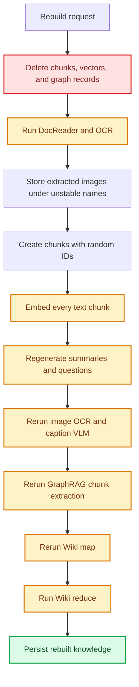
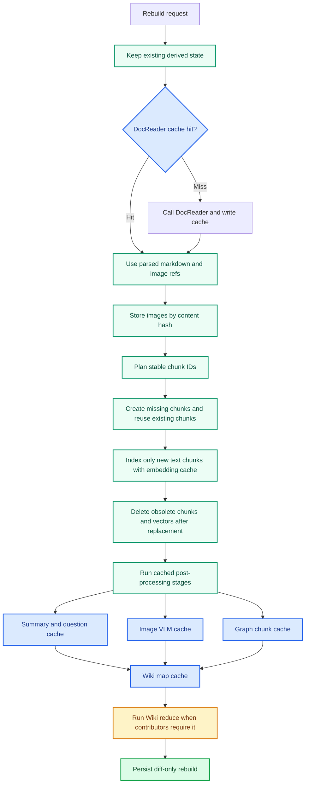

# PR: Reuse Cache on Rebuild

It changes knowledge rebuilds from full recomputation into diff-aware reuse: **unchanged content reuses completed artifacts, while only changed inputs and their dependent layers are recomputed.**

## Summary

The previous rebuild path deleted derived state early and regenerated most expensive artifacts, even when the source document had not changed. This made no-op rebuilds behave like first-time ingestion.

This change introduces stable identities, process artifact caching, and diff-aware reconciliation across the rebuild pipeline. For unchanged knowledge, DocReader/OCR, downloaded `file_url` bytes, image VLM output, embeddings, summaries, questions, GraphRAG chunk maps, and Wiki map output can now hit cache. `Wiki reduce` still runs when contributor state changes because it is the cross-document aggregation step.

## Workflow Comparison

### Previous workflow

Before this change, rebuilds were destructive and ID-unstable. The pipeline removed old chunks and related records, regenerated temporary image paths and chunk IDs, and then reran each expensive document-local stage even when the normalized document content was identical.



### New workflow

The new path keeps reusable state in place, caches `DocReader` output during conversion, stores images by content hash, reconciles chunks by stable identity, indexes only missing text chunks, and then lets post-processing stages use their own artifact caches before the unavoidable `Wiki reduce` step.



## What Changed

| Area | Before | Now | Effect |
| --- | --- | --- | --- |
| Document parsing | DocReader was rerun for each rebuild path. | `docreader:v1` caches parsed output by stable reader input and reader options. | OCR and parsing are reused for unchanged documents. |
| Downloaded `file_url` input | Temporary download paths could change between runs. | Downloaded bytes are hashed and used as the stable DocReader cache boundary. | The same downloaded bytes cache-hit even if the temp path changes. |
| Images | Image paths were unstable and often deleted before reuse. | Image bytes use stable content-addressed filenames and are protected during rebuild cleanup. | Unchanged image assets and VLM descriptions are reused. |
| Chunks | Chunks used random IDs. | Chunk IDs are derived from normalized content and position. | Rebuild reconciliation can update by diff instead of replacing everything. |
| Embeddings | Every chunk was embedded again. | `embedding:v1` caches vectors by provider, model, dimension, normalized text, and relevant config. | Unchanged chunk vectors do not call the embedding provider. |
| Summaries and questions | Generation reran whenever the rebuild ran. | `summary:v1` and `question:v1` cache by normalized prompt input plus model/config. | Unchanged chunk text skips chat completion calls. |
| GraphRAG | Chunk graph extraction reran and cache payloads were persistence-shaped. | `graph:chunk:v1` caches model output and strips chunk-specific references from payloads. | Graph extraction is reused and restored safely for the current chunk. |
| Wiki map | Wiki map generation reran on rebuilds. | `wiki:map:v1` caches map output by stable contributor material and map config. | Unchanged contributors reuse map output. |
| Wiki reduce | Cross-document reduce was part of every rebuild. | Reduce remains intentionally uncached. | The only unavoidable cost is contributor-level aggregation. |

## Implementation Coverage

This section maps the PR description to the current workspace diff so reviewers can find every changed surface.

| Surface | Files | Covered change |
| --- | --- | --- |
| Plan and PR docs | `docs/superpowers/plans/2026-07-02-reuse-cache-on-rebuild.md`, `docs/rebuild-cache-pr-description.md`, `docs/rebuild-cache-pr-description.zh-CN.md` | Keeps the implementation plan and PR description in the repo. |
| Process artifact cache schema | `migrations/sqlite/000000_init.up.sql`, `migrations/versioned/000065_rebuild_artifact_cache.up.sql`, `migrations/versioned/000065_rebuild_artifact_cache.down.sql`, `internal/types/process_artifact_cache.go`, `internal/types/interfaces/process_artifact_cache.go`, `internal/application/repository/process_artifact_cache.go`, `internal/application/repository/process_artifact_cache_test.go`, `internal/container/container.go` | Adds the tenant-scoped artifact cache table, unique cache identity, repository upsert/get behavior, and DI registration. |
| Cache keys and content addressing | `internal/application/service/rebuild_cache_keys.go`, `internal/application/service/rebuild_cache_keys_test.go`, `internal/utils/content_address.go`, `internal/utils/content_address_test.go` | Adds canonical text hashing, stable image filenames, stable chunk/question/summary child IDs, and artifact key helpers. |
| DocReader cache | `internal/application/service/knowledge_process.go`, `internal/application/service/docreader_cache_payload.go`, `internal/application/service/docreader_cache_payload_test.go`, `internal/application/service/knowledge_docreader_cache_test.go` | Caches `ReadResult` payloads and verifies that already downloaded `file_url` bytes cache-hit across different temporary file paths. |
| Rebuild-aware chunk reconciliation | `internal/application/repository/chunk.go`, `internal/application/repository/chunk_sqlite_test.go`, `internal/application/service/chunk.go`, `internal/types/interfaces/chunk.go`, `internal/application/service/knowledge_process.go` | Adds create-ignore semantics, selected-type listing, obsolete chunk plus direct-child deletion, stable chunk IDs, and diff-only vector deletion. |
| Knowledge processing entry points | `internal/application/service/knowledge.go`, `internal/application/service/knowledge_process.go`, `internal/application/service/knowledge_post_process.go` | Injects the artifact cache repo, removes eager cleanup from reparse/manual update paths, and resets graph namespaces at graph post-process time. |
| File service content-addressed storage | `internal/types/interfaces/file.go`, `internal/application/service/file/cos.go`, `internal/application/service/file/dummy.go`, `internal/application/service/file/ks3.go`, `internal/application/service/file/local.go`, `internal/application/service/file/local_test.go`, `internal/application/service/file/minio.go`, `internal/application/service/file/obs.go`, `internal/application/service/file/oss.go`, `internal/application/service/file/s3.go`, `internal/application/service/file/tos.go` | Adds `SaveContentAddressedBytes` to every storage backend so cached image bytes use deterministic tenant-scoped paths under `exports/cache`. |
| Image resolution and deletion | `internal/infrastructure/docparser/image_resolver.go`, `internal/infrastructure/docparser/image_resolver_test.go`, `internal/infrastructure/docparser/resolve_remote_images_test.go`, `internal/application/service/knowledge_delete.go` | Stores extracted images by content hash, records image content hashes, keeps whitelisted remote images unchanged, and avoids deleting shared content-addressed artifacts. |
| Image VLM and child chunks | `internal/application/service/image_multimodal.go` | Caches OCR/caption output by image bytes, prompt, model, and config; creates stable OCR/caption child chunk IDs; skips existing child chunks on retry. |
| Embeddings | `internal/application/service/cached_embedder.go`, `internal/application/service/cached_embedder_test.go`, `internal/application/service/knowledge_process.go` | Wraps embedding calls with process-cache reads/writes and uses the wrapper for main chunks, summaries, generated questions, and chunk updates. |
| Summaries and questions | `internal/application/service/knowledge_process.go`, `internal/application/service/question_cache_test.go` | Caches summary and question generation, uses stable summary chunk IDs, uses stable generated question IDs, and reuses already indexed summary chunks. |
| Graph extraction | `internal/application/service/extract.go`, `internal/application/service/extract_cache_test.go`, `internal/application/service/knowledge_post_process.go` | Caches per-chunk graph extraction and strips persisted chunk references from reusable graph payloads. |
| Wiki ingestion | `internal/application/service/wiki_ingest.go`, `internal/application/service/wiki_ingest_batch.go`, `internal/application/service/wiki_ingest_cache_test.go` | Caches Wiki map output, keeps `oldPageSlugs` out of the model cache key, stores only base updates, and rebuilds retractions from current page state on cache hit. |
| Plan-level acceptance tests | `internal/application/service/knowledge_rebuild_cache_integration_test.go` | Covers unchanged rebuilds, crash retry cache reuse, and layer-local invalidation when model or prompt config changes. |
| Compatibility test stubs | `internal/agent/tools/data_analysis_materialize_test.go`, `internal/application/service/knowledge_clone_image_test.go`, `internal/application/service/knowledge_create_test.go`, `internal/im/im_file_service_test.go`, `internal/router/router_files_test.go` | Updates test doubles to satisfy the expanded `FileService` interface. |

## Cache Boundaries

| Layer | Cache namespace | Key includes | Invalidated by |
| --- | --- | --- | --- |
| DocReader | `docreader:v1` | Reader source material, file bytes when available, reader options, parser version. | Source bytes/text changes, reader option changes, parser version changes. |
| Downloaded `file_url` bytes | `docreader:v1` | Downloaded bytes, not the temporary file path. | Downloaded content changes. |
| Image VLM | `vlm:image:v1` | Image content hash, prompt, model, provider, VLM config. | Image bytes, VLM prompt, model, or config changes. |
| Embedding | `embedding:v1` | Normalized chunk text, provider, model, dimension, embedding config. | Text, model, dimension, provider, or embedding config changes. |
| Summary | `summary:v1` | Normalized chunk text, summary prompt, model, chat config. | Text, prompt, model, or chat config changes. |
| Question | `question:v1` | Normalized chunk text, question prompt, model, chat config. | Text, prompt, model, or chat config changes. |
| Graph chunk map | `graph:chunk:v1` | Normalized chunk text, graph prompt, model, graph config. | Text, prompt, model, or graph config changes. |
| Wiki map | `wiki:map:v1` | Contributor material, map prompt, model, Wiki map config. | Contributor material, prompt, model, or map config changes. |
| Wiki reduce | None | Current Wiki contributors and page state. | Always evaluated when contributor state requires reduce. |

Two cache-boundary details are deliberate:

- `oldPageSlugs` are excluded from the Wiki map key. They are persistence context, not model input. On cache hit, retractions and base updates are rebuilt for the current page state.
- Graph chunk cache payloads do not store persisted chunk references. They are restored against the current chunk on cache hit.

## Expected Rebuild Behavior

| Scenario | Expected behavior | Covered by |
| --- | --- | --- |
| Rebuild unchanged knowledge | Near-zero LLM/VLM calls except unavoidable `Wiki reduce`. | `TestReparseUnchangedKnowledgeAvoidsExpensiveModelCalls` |
| Retry after crash | Completed OCR, vector, and Wiki map work cache-hit. | `TestCrashRetryReusesCompletedArtifacts` |
| Embedding model/config change | Embedding layer misses; OCR, VLM, summaries, questions, and Wiki map are reused when their inputs are unchanged. | `TestRebuildCacheInvalidatesOnlyChangedLayer` |
| Downloaded `file_url` stored at a different temp path | DocReader cache hits because the downloaded bytes are unchanged. | `TestConvertFileURLDownloadedBytesReuseDocReaderCacheAcrossTempPaths` |
| Existing graph and Wiki map cache payloads | Payloads are reusable without leaking stale persistence references. | `TestGraphDataCachePayloadStripsChunkRefsAndRestoresGraph`, `TestWikiMapCachePayloadDropsRetractionsAndRestoresBaseUpdates` |

## Validation

The following checks were run:

```bash
go test ./internal/application/service -count=1
go test ./internal/application/repository ./internal/application/service/file ./internal/container -count=1
go test ./internal/agent/tools ./internal/im ./internal/router -count=1
go test ./internal/utils -run 'TestStableImageFilename|TestTextContentHash|TestCanonicalCacheText|TestStableJSONHash|TestArtifactCacheKey|TestSHA256HexBytes' -count=1
go test ./internal/infrastructure/docparser -run 'TestResolveAndStore|TestResolveRemoteImages|TestIsIconImage|TestResolveDataURI|TestResolveHTMLDataURI|TestResolveBareBase64' -count=1
```

Local note: the full `go test ./internal/utils -count=1` command was not used as final evidence because this environment resolves `example.com` to `198.18.0.85`, which trips existing SSRF tests unrelated to this change. The cache-related utility tests were run directly.
