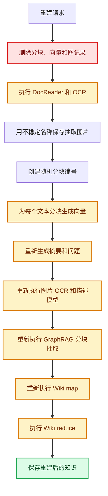
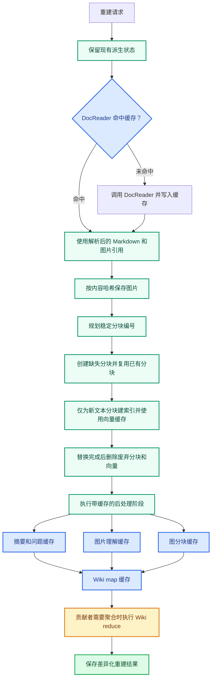

# PR：重建时复用缓存

本文档是 `docs/rebuild-cache.md` 的中文版本。知识重建不再等价于全量重算，而是变成按差异复用：内容未变化时复用已完成的中间产物，只有变化的输入及其依赖层需要重新计算。

## 摘要

原有重建路径会过早删除派生状态，并重新生成大部分高成本产物。即使源文档内容没有变化，一次空重建也会接近首次摄取的成本。

本次改动为重建流水线引入稳定身份、过程产物缓存和按差异对账。对于未变化的知识，`DocReader`、OCR、已下载的 `file_url` 字节、图片视觉语言模型输出、向量、摘要、问题、`GraphRAG` 分块映射和 `Wiki map` 输出都可以命中缓存。`Wiki reduce` 仍会在贡献者状态变化时执行，因为它是跨文档聚合步骤。

## 工作流对比

### 原工作流

改动前，重建是破坏式且身份不稳定的。流水线会删除旧分块和相关记录，重新生成临时图片路径和分块编号，然后在归一化文档内容完全一致时仍然重新执行每个高成本的文档局部阶段。



### 新工作流

新路径会保留可复用状态，在转换阶段缓存 `DocReader` 输出，按内容哈希保存图片，按稳定身份对账分块，只为缺失文本分块建索引，然后让后处理阶段各自使用产物缓存，最后执行不可避免的 `Wiki reduce`。



## 改动内容

| 范围 | 之前 | 现在 | 效果 |
| --- | --- | --- | --- |
| 文档解析 | 每次重建都会重新执行 `DocReader`。 | `docreader:v1` 按稳定读取输入和读取选项缓存解析输出。 | 未变化文档复用 OCR 和解析结果。 |
| 已下载的 `file_url` 输入 | 临时下载路径可能在多次运行间变化。 | 已下载字节会参与哈希，并作为稳定的 `DocReader` 缓存边界。 | 相同下载字节即使命中不同临时路径也能命中缓存。 |
| 图片 | 图片路径不稳定，且常在复用前被删除。 | 图片字节使用按内容寻址的稳定文件名，并在重建清理时受保护。 | 未变化图片资源和图片描述被复用。 |
| 分块 | 分块使用随机编号。 | 分块编号由归一化内容和位置生成。 | 重建对账可以按差异更新，而不是整体替换。 |
| 向量 | 每个分块都会重新生成向量。 | `embedding:v1` 按服务商、模型、维度、归一化文本和相关配置缓存向量。 | 未变化分块不会调用向量服务。 |
| 摘要和问题 | 每次重建都会重新生成。 | `summary:v1` 和 `question:v1` 按归一化提示词输入、模型和配置缓存。 | 未变化分块跳过对话补全调用。 |
| `GraphRAG` | 分块图抽取会重新运行，缓存载荷也偏向持久化形态。 | `graph:chunk:v1` 缓存模型输出，并从载荷中移除分块专属引用。 | 图抽取结果可复用，并可安全恢复到当前分块。 |
| `Wiki map` | 重建时会重新生成。 | `wiki:map:v1` 按稳定贡献者材料和映射配置缓存输出。 | 未变化贡献者复用映射输出。 |
| `Wiki reduce` | 每次重建路径都会进入跨文档聚合。 | 该步骤保持不缓存。 | 唯一不可避免的成本是贡献者级聚合。 |

## 实现覆盖范围

本节把 PR 说明映射到当前工作区的实际 diff，方便评审者定位每一类改动。

| 范围 | 文件 | 覆盖的改动 |
| --- | --- | --- |
| 计划和 PR 文档 | `docs/superpowers/plans/2026-07-02-reuse-cache-on-rebuild.md`, `docs/rebuild-cache-pr-description.md`, `docs/rebuild-cache-pr-description.zh-CN.md` | 在仓库中保留实现计划和 PR 说明。 |
| 过程产物缓存 schema | `migrations/sqlite/000000_init.up.sql`, `migrations/versioned/000065_rebuild_artifact_cache.up.sql`, `migrations/versioned/000065_rebuild_artifact_cache.down.sql`, `internal/types/process_artifact_cache.go`, `internal/types/interfaces/process_artifact_cache.go`, `internal/application/repository/process_artifact_cache.go`, `internal/application/repository/process_artifact_cache_test.go`, `internal/container/container.go` | 新增租户级产物缓存表、唯一缓存身份、repository 写入或更新和读取能力，以及依赖注入注册。 |
| 缓存键和按内容寻址 | `internal/application/service/rebuild_cache_keys.go`, `internal/application/service/rebuild_cache_keys_test.go`, `internal/utils/content_address.go`, `internal/utils/content_address_test.go` | 新增规范化文本哈希、稳定图片文件名、稳定分块/问题/摘要子分块编号，以及各层产物缓存键。 |
| `DocReader` 缓存 | `internal/application/service/knowledge_process.go`, `internal/application/service/docreader_cache_payload.go`, `internal/application/service/docreader_cache_payload_test.go`, `internal/application/service/knowledge_docreader_cache_test.go` | 缓存 `ReadResult` 载荷，并验证已下载的 `file_url` 字节在临时路径变化时仍然命中缓存。 |
| 重建感知的分块对账 | `internal/application/repository/chunk.go`, `internal/application/repository/chunk_sqlite_test.go`, `internal/application/service/chunk.go`, `internal/types/interfaces/chunk.go`, `internal/application/service/knowledge_process.go` | 新增忽略已存在行的创建、按类型列出旧分块、删除废弃分块及直接子分块、稳定分块编号，以及只删除差异向量。 |
| 知识处理入口 | `internal/application/service/knowledge.go`, `internal/application/service/knowledge_process.go`, `internal/application/service/knowledge_post_process.go` | 注入产物缓存 repository，移除重解析和手动更新路径的提前清理，并把图命名空间重置移动到图后处理阶段。 |
| 文件服务按内容寻址存储 | `internal/types/interfaces/file.go`, `internal/application/service/file/cos.go`, `internal/application/service/file/dummy.go`, `internal/application/service/file/ks3.go`, `internal/application/service/file/local.go`, `internal/application/service/file/local_test.go`, `internal/application/service/file/minio.go`, `internal/application/service/file/obs.go`, `internal/application/service/file/oss.go`, `internal/application/service/file/s3.go`, `internal/application/service/file/tos.go` | 为所有存储后端新增 `SaveContentAddressedBytes`，让缓存图片字节保存到租户级稳定路径 `exports/cache` 下。 |
| 图片解析和删除 | `internal/infrastructure/docparser/image_resolver.go`, `internal/infrastructure/docparser/image_resolver_test.go`, `internal/infrastructure/docparser/resolve_remote_images_test.go`, `internal/application/service/knowledge_delete.go` | 按内容哈希保存抽取图片、记录图片内容哈希、保留白名单远程图片原链接，并避免删除共享的按内容寻址产物。 |
| 图片理解和子分块 | `internal/application/service/image_multimodal.go` | 按图片字节、提示词、模型和配置缓存 OCR/描述结果；创建稳定 OCR/描述子分块编号；重试时跳过已存在子分块。 |
| 向量 | `internal/application/service/cached_embedder.go`, `internal/application/service/cached_embedder_test.go`, `internal/application/service/knowledge_process.go` | 用过程缓存包裹向量调用，并在正文分块、摘要、生成问题和分块更新中复用该包装器。 |
| 摘要和问题 | `internal/application/service/knowledge_process.go`, `internal/application/service/question_cache_test.go` | 缓存摘要和问题生成，使用稳定摘要分块编号、稳定生成问题编号，并复用已建索引的摘要分块。 |
| 图抽取 | `internal/application/service/extract.go`, `internal/application/service/extract_cache_test.go`, `internal/application/service/knowledge_post_process.go` | 缓存每个分块的图抽取结果，并从可复用图载荷中移除持久化分块引用。 |
| `Wiki` 摄取 | `internal/application/service/wiki_ingest.go`, `internal/application/service/wiki_ingest_batch.go`, `internal/application/service/wiki_ingest_cache_test.go` | 缓存 `Wiki map` 输出，不把 `oldPageSlugs` 放入模型缓存键，只缓存基础更新，并在命中缓存时按当前页面状态重建撤回操作。 |
| 计划级验收测试 | `internal/application/service/knowledge_rebuild_cache_integration_test.go` | 覆盖未变化重建、崩溃续跑缓存复用，以及模型或提示词配置变化时的层级局部失效。 |
| 兼容性测试桩 | `internal/agent/tools/data_analysis_materialize_test.go`, `internal/application/service/knowledge_clone_image_test.go`, `internal/application/service/knowledge_create_test.go`, `internal/im/im_file_service_test.go`, `internal/router/router_files_test.go` | 更新测试替身以满足扩展后的 `FileService` 接口。 |

## 缓存边界

| 层 | 缓存命名空间 | 缓存键包含 | 失效条件 |
| --- | --- | --- | --- |
| `DocReader` | `docreader:v1` | 读取源材料、可用时的文件字节、读取选项、解析器版本。 | 源字节或文本变化、读取选项变化、解析器版本变化。 |
| 已下载的 `file_url` 字节 | `docreader:v1` | 已下载字节，而不是临时文件路径。 | 下载内容变化。 |
| 图片理解 | `vlm:image:v1` | 图片内容哈希、提示词、模型、服务商、视觉语言模型配置。 | 图片字节、提示词、模型或配置变化。 |
| 向量 | `embedding:v1` | 归一化分块文本、服务商、模型、维度、向量配置。 | 文本、模型、维度、服务商或向量配置变化。 |
| 摘要 | `summary:v1` | 归一化分块文本、摘要提示词、模型、对话配置。 | 文本、提示词、模型或对话配置变化。 |
| 问题 | `question:v1` | 归一化分块文本、问题提示词、模型、对话配置。 | 文本、提示词、模型或对话配置变化。 |
| 图分块映射 | `graph:chunk:v1` | 归一化分块文本、图提示词、模型、图配置。 | 文本、提示词、模型或图配置变化。 |
| `Wiki map` | `wiki:map:v1` | 贡献者材料、映射提示词、模型、映射配置。 | 贡献者材料、提示词、模型或映射配置变化。 |
| `Wiki reduce` | 无 | 当前 `Wiki` 贡献者和页面状态。 | 当贡献者状态需要聚合时始终评估。 |

下面两个缓存边界是刻意设计的：

- `oldPageSlugs` 不进入 `Wiki map` 缓存键。它是持久化上下文，不是模型输入。缓存命中时，撤回信息和基础更新会按当前页面状态重新构造。
- 图分块缓存载荷不保存持久化分块引用。缓存命中后，它们会恢复到当前分块上。

## 预期重建行为

| 场景 | 预期行为 | 覆盖测试 |
| --- | --- | --- |
| 重建未变化知识 | 除不可避免的 `Wiki reduce` 外，模型调用接近零。 | `TestReparseUnchangedKnowledgeAvoidsExpensiveModelCalls` |
| 崩溃后重试 | 已完成的 OCR、向量和 `Wiki map` 工作命中缓存。 | `TestCrashRetryReusesCompletedArtifacts` |
| 向量模型或配置变化 | 仅向量层未命中；当输入未变化时，OCR、图片理解、摘要、问题和 `Wiki map` 复用。 | `TestRebuildCacheInvalidatesOnlyChangedLayer` |
| 已下载的 `file_url` 被保存到不同临时路径 | 因下载字节未变化，`DocReader` 命中缓存。 | `TestConvertFileURLDownloadedBytesReuseDocReaderCacheAcrossTempPaths` |
| 已有图和 `Wiki map` 缓存载荷 | 载荷可复用，且不会泄漏过期持久化引用。 | `TestGraphDataCachePayloadStripsChunkRefsAndRestoresGraph`, `TestWikiMapCachePayloadDropsRetractionsAndRestoresBaseUpdates` |

## 验证

已执行以下检查：

```bash
go test ./internal/application/service -count=1
go test ./internal/application/repository ./internal/application/service/file ./internal/container -count=1
go test ./internal/agent/tools ./internal/im ./internal/router -count=1
go test ./internal/utils -run 'TestStableImageFilename|TestTextContentHash|TestCanonicalCacheText|TestStableJSONHash|TestArtifactCacheKey|TestSHA256HexBytes' -count=1
go test ./internal/infrastructure/docparser -run 'TestResolveAndStore|TestResolveRemoteImages|TestIsIconImage|TestResolveDataURI|TestResolveHTMLDataURI|TestResolveBareBase64' -count=1
```

本地说明：完整的 `go test ./internal/utils -count=1` 没有作为最终证据，因为当前环境会把 `example.com` 解析到 `198.18.0.85`，触发与本次改动无关的既有 SSRF 测试失败。本次已直接运行缓存相关的工具函数测试。
